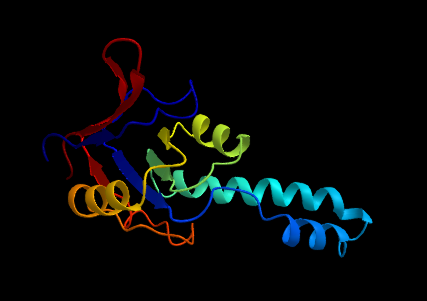
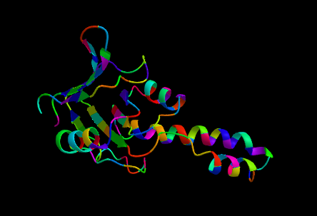
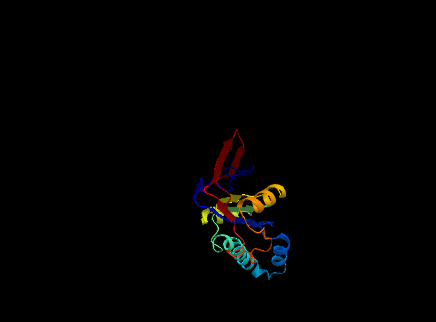

#  ProtPlot

[](https://MurrellGroup.github.io/ProtPlot.jl/stable/)
[](https://MurrellGroup.github.io/ProtPlot.jl/dev/)
[](https://github.com/MurrellGroup/ProtPlot.jl/actions/workflows/CI.yml?query=branch%3Amain)
[](https://codecov.io/gh/MurrellGroup/ProtPlot.jl)

ProtPlot is a Julia package for rendering 3D protein ribbon using [Makie.jl](https://github.com/MakieOrg/Makie.jl).

## Overview

ProtPlot exports the Ribbon plot:
- `ribbon`: makes a static render of the ribbon.
- `ribbon!`: renders the ribbon plot within an existing container (e.g., `Scene` or `Axis3`).
- `ribbon_scene`: creates an interactive Scene to render the ribbon.

## Examples

Ribbon plots are constructed from vectors of protein backbones represented as `3x3xL` arrays.
For convenience, argument conversion methods are defined, and the ribbon constructors can take:
- a `3x3xL` array of residue backbone atom coordinates (N, Ca, C), or a vector of these for each chain.
- a `BioStructures.MolecularStructure` or `BioStructures.Chain`.
- a PDB file path.

```julia
using GLMakie # use the GLMakie backend
using ProtPlot

# Create and display a ribbon plot in an interactive window
ribbon_scene("test/data/1ASS.pdb", backgroundcolor=:black, colormap=:jet)
```


## Customizing colors

Use the `colors` keyword argument to customize colors at the residue level. This argument should be a vector of vectors, where each vector contains either:

- values between 0 and 1, representing the colors of each residue in their respective chains according to the `colormap`.
- a list of [`Colorant`s](https://github.com/JuliaGraphics/ColorTypes.jl?tab=readme-ov-file#colortypes), one per residue. For example, `RGBA(1, 0, 0, 0.5)` for a 50% transparent red. Load the `ColorTypes` or `Colors` package to create such `Colorant`s.

```julia
# Load protein data from a PDB file
chains = readpdb("test/data/1ASS.pdb")

colors = rand.(length.(chains))

ribbon_scene(chains, colors=colors, colormap=:hsv)
```


## Attributes
You may customize the geometry of the ribbon by specifying the value of attributes in the keyword arguments of your call. Here's a list of available attributes and their defaults:
- `secondary_structures = nothing` (gets assigned by an algorithm by default; needs to be a vector of `Vector{Int}` where `1` means loop, `2` means helix, and `3` means strand)
- `colors = nothing` (gets assigned `range(0, 1, L)` for each chain by default, mapping to `colormap`; overrides colormap if colorants are given)
- `colormap = :jet` (see the [ColorSchemes.jl catalogue](https://juliagraphics.github.io/ColorSchemes.jl/stable/catalogue/); can also be a vector of colorants)

- `coil_diameter = 0.4`
- `coil_spline_quality = 20`
- `coil_slice_quality = 20`

- `helix_width = 2.0`
- `helix_thickness = 0.5`
- `helix_spline_quality = 20`
- `helix_slice_quality = 20`

- `strand_width = 2.0`
- `strand_thickness = 0.5`
- `strand_arrow_head_length = 5.0`
- `strand_arrow_head_width = 3.5`
- `strand_spline_quality = 20`

## Camera controls

Makie allows programmatic control over the [camera](https://docs.makie.org/stable/explanations/cameras/index.html).
Use the `camcontrols` keyword to control the initial view in a `ribbon_scene` call:

```julia
ribbon_scene("test/data/1ASS.pdb", camcontrols=(; lookat=Vec3f(30, 0, 60), eyeposition=Vec3f(160, -75, 0), upvector=Vec3f(0, 0, 1)))
```


## See also
- [BioMakie.jl](https://github.com/BioJulia/BioMakie.jl) (designed for more interactivity)
