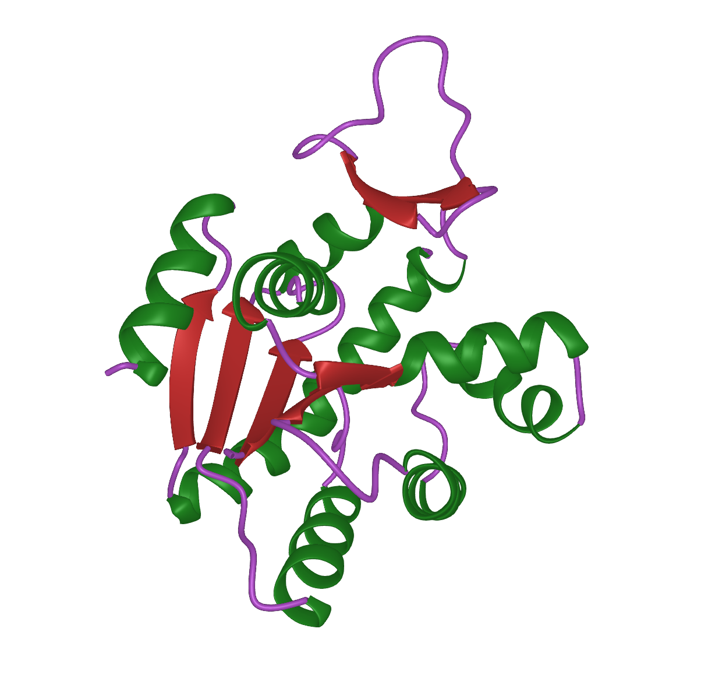

#  ProtPlot

[](https://github.com/MurrellGroup/ProtPlot.jl/releases/latest)
[](https://opensource.org/license/MIT)
[](https://github.com/MurrellGroup/ProtPlot.jl/actions/workflows/CI.yml?query=branch%3Amain)
[](https://codecov.io/gh/MurrellGroup/ProtPlot.jl)

ProtPlot is a Julia package for rendering 3D protein ribbon plots using [GLMakie.jl](https://github.com/JuliaPlots/GLMakie.jl). For backbone atom coordinates and secondary structure assignment, it uses [Backboner.jl](https://github.com/MurrellGroup/Backboner.jl) (which in turn uses [AssigningSecondaryStructure.jl](https://github.com/MurrellGroup/AssigningSecondaryStructure.jl)).

## Usage

ProtPlot offers two primary functions: `ribbon` and `ribbon!`:
- `ribbon`: Creates a new interactive window to render the ribbon plot.
- `ribbon!`: Renders the ribbon plot within an existing container (e.g., `Scene` or `Axis3`). 

### Example usage

```julia
using ProtPlot

# Load protein data from a PDB file
protein = pdb_to_protein("test/data/1ZAK.pdb");

# Create and display a ribbon plot in a new window
ribbon(protein, backgroundcolor=:black, colorscheme=:jet)
```
This example will open an interactive window featuring a ribbon plot of the protein with a black background and colors based on the jet colormap.

### Customizing colors

To customize colors at the residue level, use the color_vectors keyword argument. This argument accepts a vector of vectors, where each inner vector contains colors or numeric values between 0 and 1, representing the colors of each residue in a chain. If numbers are passed instead of colors, they will be converted according to the colorscheme. 
