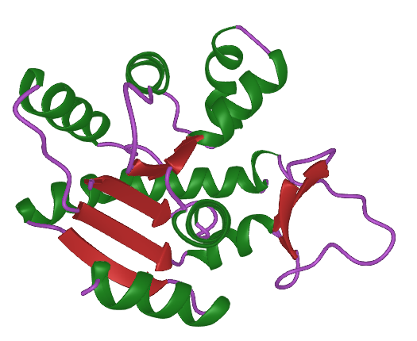

#  ProtPlot

[](https://github.com/MurrellGroup/ProtPlot.jl/releases/latest)
[](https://opensource.org/license/MIT)
[](https://github.com/MurrellGroup/ProtPlot.jl/actions/workflows/CI.yml?query=branch%3Amain)
[](https://codecov.io/gh/MurrellGroup/ProtPlot.jl)

ProtPlot is a Julia package for rendering 3D protein ribbon using [Makie.jl](https://github.com/MakieOrg/Makie.jl).

## Overview

ProtPlot exports the Ribbon plot:
- `ribbon`: makes a static render of the ribbon.
- `ribbon!`: renders the ribbon plot within an existing container (e.g., `Scene` or `Axis3`).
- `ribbon_scene`: creates an interactive Scene to render the ribbon.

## Examples

A ribbon plot is constructed from a `Vector{Backboner.Protein.Chain}`, which you can obtain from a PDB file using the exported `readpdb` function. Alternatively, you can pass a single chain, or a PDB file path. 

```julia
using GLMakie # use the GLMakie backend
using ProtPlot

# Create and display a ribbon plot in an interactive window
ribbon_scene("test/data/1ASS.pdb", backgroundcolor=:black, colormap=:jet)
```


## Customizing colors

Use the `colors` keyword argument to customize colors at the residue level. This argument should be a vector of vectors, where each inner vector contains values between 0 and 1, representing the colors of each residue in a chain according to the `colormap`. These colors are recursively passed to the rendering functions, ensuring that each residue is colored appropriately.

```julia
# Load protein data from a PDB file
chains = readpdb("test/data/1ASS.pdb")

colors = rand.(length.(chains))

ribbon_scene(chains, colors=colors, colormap=:hsv)
```


## Camera controls

Makie allows programmatic control over the [camera](https://docs.makie.org/stable/explanations/cameras/index.html).
Use the `camcontrols` keyword to control the initial view:

```julia
ribbon_scene("test/data/1ASS.pdb", camcontrols=(; lookat=Vec3f(30, 0, 60), eyeposition=Vec3f(160, -75, 0), upvector=Vec3f(0, 0, 1)))
```

